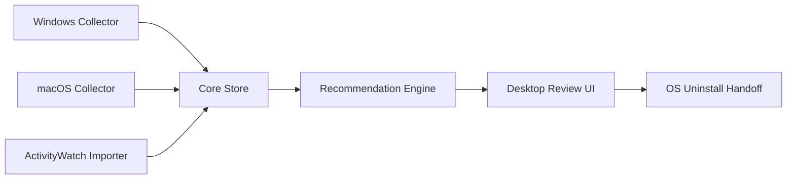

# Architecture

RevPref is organized around a narrow core and replaceable platform collectors.

## Collectors

Collectors produce app records and usage aggregates. They should be read-only by default.

Expected collector families:

- Windows installed apps: registry uninstall keys, MSIX packages, WinGet, Steam libraries.
- Windows startup: registry run keys, Startup folders, scheduled tasks, services.
- Windows usage: foreground window process, launch count, background runtime.
- macOS installed apps: app bundles, receipts, Homebrew casks, pkgutil receipts.
- macOS startup: Login Items, LaunchAgents, LaunchDaemons.
- macOS usage: active app events through native APIs.
- Optional importers: ActivityWatch buckets.

## Core Store

The store should keep aggregate data, not raw surveillance data.

Good:

- App ID.
- Last foreground timestamp.
- Foreground seconds over recent windows.
- Launch count.
- Startup entry count.
- Approximate app size.

Avoid by default:

- Full window title history.
- Full browser URL history.
- Screenshots.
- Keystrokes.

## Recommendation Engine

The engine turns app facts into explainable suggestions. It should be deterministic, testable, and conservative.

It should output:

- Action type.
- Severity.
- Score.
- Human-readable title.
- Evidence/reasons.
- Suggested next step.

## Desktop Shell

The shell should let users:

- Review recommendations.
- Mark an app as keep/ignore.
- Inspect evidence.
- Open the app's official uninstall flow.
- Export local data.
- Delete local data.
